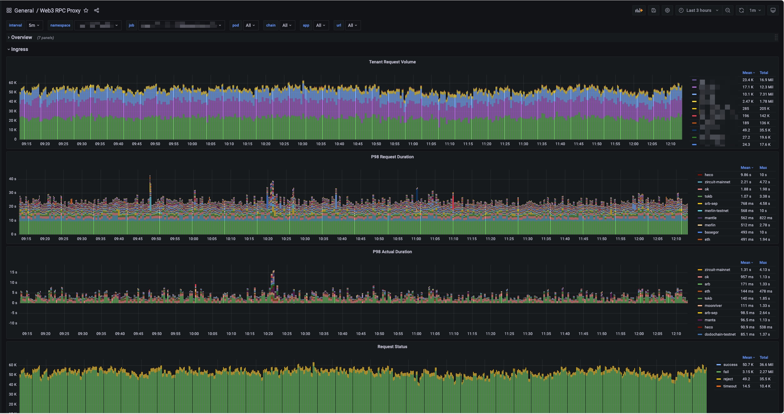
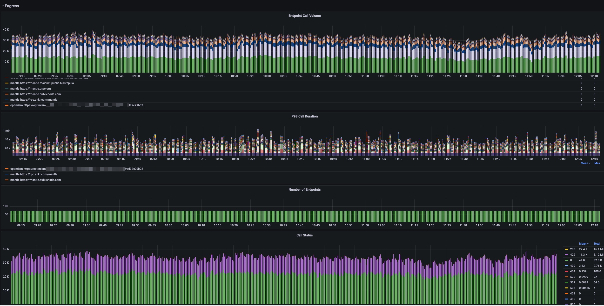
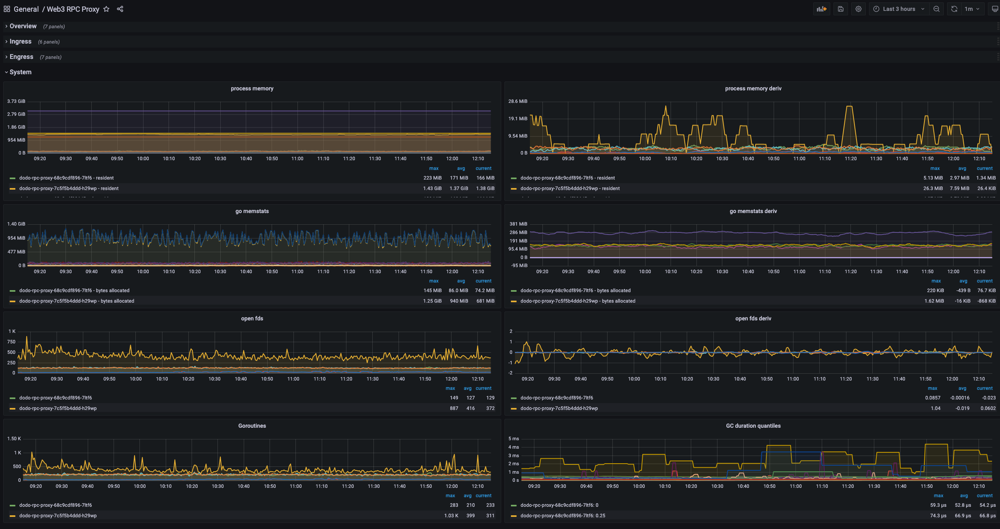
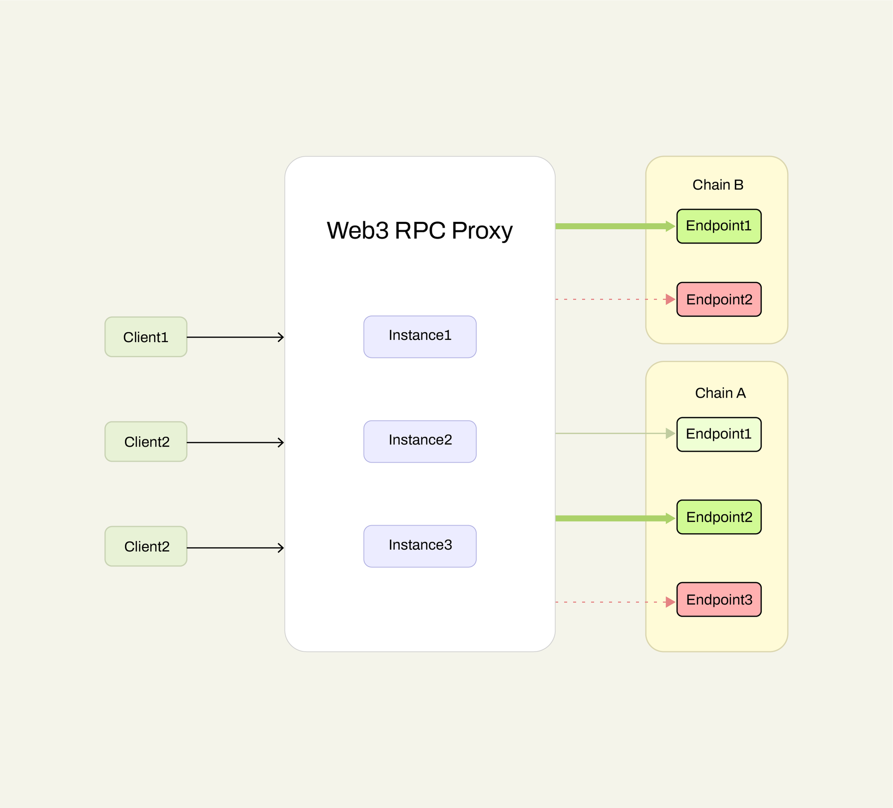

<div align="center" id="top">

&#xa0;

  
</div>
<h1 align="center">Web3 RPC Proxy</h1>


## :dart: Introduction

Web3 RPC Proxy is a proxy middleware for accessing EVM blockchains that supports cluster deployment, designed to provide users with optimal, stable, and latest block height proxy access.

<br>

## :sparkles: Features

- :zap: High concurrency, fast access
- :raised_hands: Combined with [web3-rpc-provider](https://github.com/GoPlugin/web3-rpc-provider) to automatically load available free endpoints
- :dizzy: Flexible support for multiple chains
- :mag: Efficient endpoint selection
- :construction_worker: Supports distributed deployment
- :chart_with_upwards_trend: Comprehensive reporting support

<br>

### Functionality

- Tenant isolation
- Multi-bucket rate limiting
- Request result caching and reuse
- WSS endpoint configuration
- Dynamic endpoint configuration updates
- JSON-RPC API schema validation
- Alternating retries across multiple endpoints
- Prometheus metrics
- Grafana monitoring reports

<br>

## :rocket: Deployment

```bash
# Build the docker image
$ docker build ./Dockerfile -t goplugin/web3-rpc-proxy:latest

# Run the image
$ docker run -p 8080:8080 -d goplugin/web3-rpc-proxy:latest
```

Or

```bash
# Start the service using docker compose
$ docker-compose up
```

Modify system configuration using the following environment variables:

- `WEB3RPCPROXY_APP_HOST` to set the service host and port, default is `0.0.0.0:8080`
- `WEB3RPCPROXY_ETCD_CONFIG_ENDPOINTS` to set the ETCD endpoints
- `WEB3RPCPROXY_ETCD_SETUP_CONFIG_FILE` to specify the system startup configuration path on ETCD
- `WEB3RPCPROXY_ETCD_ENDPOINTS_CONFIG_FILE` to specify the endpoint configuration path on ETCD for each chain

### Dependencies

- PostgreSQL Depends on [the Tenant table](internal/database/schema/tenant.go)
- Redis Used for distributed rate limiting of Tenant in the service
- Amqp, optional After completion, the request information will be published to the mq

### Grafana Reports
Import [the Grafana template file](config/grafana.json)





<br>

## :bulb: Usage
The usage is straightforward, just make a JSON-RPC request to a specific chain.

```bash
$ curl --location --request POST 'https://localhost:8080/{{CHAIN}}' \
--header 'Content-Type: application/json' \
--data-raw '[
    {
        "jsonrpc": "2.0",
        "id": 1,
        "method": "net_version",
        "params": []
    },
    {
        "jsonrpc": "2.0",
        "id": 2,
        "method": "eth_blockNumber",
        "params": []
    }
]'
```

- `CHAIN`: Required Represents
    the Chain ID or code of a specific blockchain, refer to the YAML configuration file below.
### Request Parameters:
- `x_api_key`: Required
    The client must provide an API key when accessing the service, otherwise, it will be rejected with a 403 error. It can also be provided via the `X-API-KEY` header.
- `x_api_bucket`: Optional
    Allows the client to specify different buckets based on the situation, placing different values into different buckets for separate rate limiting. It can also be provided via the `X-API-BUCKET` header, such as using different chain IDs as bucket values to isolate rate limiting.
- `cache`: Optional, default `true`
    Whether to use cache, acceptable values are `true`, `false`
- `timeout`: Optional, default `30000ms`
    Timeout duration, if exceeded, the request returns a 408 error
- `attempts`: Optional, default `3`
    Maximum retry attempts, 0 means no retries
- `attempt_strategy`: Optional, default `same`
    The strategy for selecting endpoints during failure retries: `same` always retries the same endpoint, `rotation` alternates retries among available endpoints
- `endpoint_type`: Optional, string, `default`
    Specifies the type of endpoint to select: `default` automatically selects the most suitable endpoint type based on the request method, acceptable values are `fullnode`, `activenode`

For details on the JSON-RPC call body, see [JSON-RPC API METHODS](https://ethereum.org/en/developers/docs/apis/json-rpc/#json-rpc-methods)

<br>

## :wrench: Configuration
See [the default configuration file](config/default.yaml)

<br>

## :technologist: Development

### Starting the Project
```bash
# Clone the project
$ git clone https://github.com/GoPlugin/web3-rpc-proxy

# Navigate to the project directory
$ cd web3-rpc-proxy

# Install project dependencies
go mod download

# Start the project
go run ./cmd/main.go
```

### Local Debugging
Add a configuration `config/local.yaml` in the directory to override `config/default.yaml` for local development and debugging.

> [!NOTE]
> The endpoint configuration for each chain should be written under the `endpoints` configuration item.
> See [the default configuration file](config/default.yaml)

### Technology
The project uses the following technologies:

- [Fasthttp](https://github.com/valyala/fasthttp)
- [PostgreSQL](https://www.postgresql.org)

<br>

### Architecture



## :speech_balloon: FAQs

- How to select an endpoint?
    > The endpoints are selected based on the nodes configured in WEB3RPCPROXY_ETCD_ENDPOINTS_CONFIG_FILE, and are chosen by sorting them according to their calculated scores.

- What is the configuration priority?
    > The configuration priority is: local < env < etcd.
    
<br>

## :busts_in_silhouette: Contribute
If you want to contribute to the Web3 RPC Proxy project:

Fix issues: Find and fix issues in the project.
Write documentation: Improve and write relevant documentation for the project.
Write tests: Write and optimize test cases for the project.

If you want to show appreciation or support the continued development of the Web3 RPC Proxy project, you can do so by:

Giving the project a GitHub Star. Supporting the project by donating a cup of tea.

<br>

## :memo: License
This project is under license from MIT. For more details, see [the LICENSE file](LICENSE).

&#xa0;

<div align="center"><a href="#top">Back to top</a></div>

## List of API's

```bash 
curl -X POST http://localhost:8080 \
  -H "Content-Type: application/json" \
  -d '{"jsonrpc":"2.0","method":"eth_accounts","params":[],"id":1}'
```

```bash 
curl -X POST http://localhost:8080 \
  -H "Content-Type: application/json" \
  -d '{"jsonrpc":"2.0","method":"eth_blobBaseFee","params":[],"id":2}'
```

```bash 
curl -X POST http://localhost:8080 \
  -H "Content-Type: application/json" \
  -d '{"jsonrpc":"2.0","method":"eth_blockNumber","params":[],"id":3}'
```

```bash 
curl -X POST http://localhost:8080 \
  -H "Content-Type: application/json" \
  -d '{"jsonrpc":"2.0","method":"eth_call","params":[{"from":"0x1234567890abcdef1234567890abcdef12345678","to":"0x1234567890abcdef1234567890abcdef12345678","data":"0x"},"latest"],"id":4}'
```

```bash 
curl -X POST http://localhost:8080 \
  -H "Content-Type: application/json" \
  -d '{"jsonrpc":"2.0","method":"eth_chainId","params":[],"id":5}'
```

```bash 
curl -X POST http://localhost:8080 \
  -H "Content-Type: application/json" \
  -d '{"jsonrpc":"2.0","method":"eth_coinbase","params":[],"id":6}'
```

```bash 
curl -X POST http://localhost:8080 \
  -H "Content-Type: application/json" \
  -d '{"jsonrpc":"2.0","method":"eth_createAccessList","params":[{"from":"0x1234567890abcdef1234567890abcdef12345678","to":"0x1234567890abcdef1234567890abcdef12345678","data":"0x"},"latest"],"id":7}'
```

```bash 
curl -X POST http://localhost:8080 \
  -H "Content-Type: application/json" \
  -d '{"jsonrpc":"2.0","method":"eth_estimateGas","params":[{"from":"0x1234567890abcdef1234567890abcdef12345678","to":"0x1234567890abcdef1234567890abcdef12345678","data":"0x"},"latest"],"id":8}'
```

```bash 
curl -X POST http://localhost:8080 \
  -H "Content-Type: application/json" \
  -d '{"jsonrpc":"2.0","method":"eth_feeHistory","params":["0xa","latest",[25,50,75]],"id":9}'
```

```bash 
curl -X POST http://localhost:8080 \
  -H "Content-Type: application/json" \
  -d '{"jsonrpc":"2.0","method":"eth_gasPrice","params":[],"id":10}'
```

```bash 
curl -X POST http://localhost:8080 \
  -H "Content-Type: application/json" \
  -d '{"jsonrpc":"2.0","method":"eth_getBalance","params":["0x1234567890abcdef1234567890abcdef12345678","latest"],"id":11}'
```

```bash 
curl -X POST http://localhost:8080 \
  -H "Content-Type: application/json" \
  -d '{"jsonrpc":"2.0","method":"eth_getBlockByHash","params":["0x1234567890abcdef1234567890abcdef1234567890abcdef1234567890abcdef",true],"id":12}'
```

```bash 
curl -X POST http://localhost:8080 \
  -H "Content-Type: application/json" \
  -d '{"jsonrpc":"2.0","method":"eth_getBlockByNumber","params":["latest",true],"id":13}'
```

```bash 
curl -X POST http://localhost:8080 \
  -H "Content-Type: application/json" \
  -d '{"jsonrpc":"2.0","method":"eth_getBlockReceipts","params":["latest"],"id":14}'
```


```bash 
curl -X POST http://localhost:8080 \
  -H "Content-Type: application/json" \
  -d '{"jsonrpc":"2.0","method":"eth_getCode","params":["0x1234567890abcdef1234567890abcdef12345678","latest"],"id":15}'
```

```bash 
curl -X POST http://localhost:8080 \
  -H "Content-Type: application/json" \
  -d '{"jsonrpc":"2.0","method":"eth_getFilterChanges","params":["0x1"],"id":16}'
```

```bash 
curl -X POST http://localhost:8080 \
  -H "Content-Type: application/json" \
  -d '{"jsonrpc":"2.0","method":"eth_getFilterLogs","params":["0x1"],"id":17}'
```

```bash 
curl -X POST http://localhost:8080 \
  -H "Content-Type: application/json" \
  -d '{"jsonrpc":"2.0","method":"eth_getLogs","params":[{"fromBlock":"0x1","toBlock":"latest","address":"0x1234567890abcdef1234567890abcdef12345678"}],"id":18}'
```

```bash 
curl -X POST http://localhost:8080 \
  -H "Content-Type: application/json" \
  -d '{"jsonrpc":"2.0","method":"eth_getProof","params":["0x1234567890abcdef1234567890abcdef12345678",["0x0000000000000000000000000000000000000000000000000000000000000000"],"latest"],"id":19}'
```

```bash 
curl -X POST http://localhost:8080 \
  -H "Content-Type: application/json" \
  -d '{"jsonrpc":"2.0","method":"eth_getStorageAt","params":["0x1234567890abcdef1234567890abcdef12345678","0x0","latest"],"id":20}'
```

```bash 
curl -X POST http://localhost:8080 \
  -H "Content-Type: application/json" \
  -d '{"jsonrpc":"2.0","method":"eth_getTransactionByBlockHashAndIndex","params":["0x1234567890abcdef1234567890abcdef1234567890abcdef1234567890abcdef","0x0"],"id":21}'
```

```bash 
curl -X POST http://localhost:8080 \
  -H "Content-Type: application/json" \
  -d '{"jsonrpc":"2.0","method":"eth_getTransactionByBlockNumberAndIndex","params":["latest","0x0"],"id":22}'
```

```bash 
curl -X POST http://localhost:8080 \
  -H "Content-Type: application/json" \
  -d '{"jsonrpc":"2.0","method":"eth_getTransactionByHash","params":["0x1234567890abcdef1234567890abcdef1234567890abcdef1234567890abcdef"],"id":23}'
```

```bash 
curl -X POST http://localhost:8080 \
  -H "Content-Type: application/json" \
  -d '{"jsonrpc":"2.0","method":"eth_getTransactionCount","params":["0x1234567890abcdef1234567890abcdef12345678","latest"],"id":24}'
```

```bash 
curl -X POST http://localhost:8080 \
  -H "Content-Type: application/json" \
  -d '{"jsonrpc":"2.0","method":"eth_getTransactionReceipt","params":["0x1234567890abcdef1234567890abcdef1234567890abcdef1234567890abcdef"],"id":25}'
```

```bash 
curl -X POST http://localhost:8080 \
  -H "Content-Type: application/json" \
  -d '{"jsonrpc":"2.0","method":"eth_getUncleCountByBlockHash","params":["0x1234567890abcdef1234567890abcdef1234567890abcdef1234567890abcdef"],"id":26}'
```

```bash 
curl -X POST http://localhost:8080 \
  -H "Content-Type: application/json" \
  -d '{"jsonrpc":"2.0","method":"eth_getUncleCountByBlockNumber","params":["latest"],"id":27}'
```

```bash 
curl -X POST http://localhost:8080 \
  -H "Content-Type: application/json" \
  -d '{"jsonrpc":"2.0","method":"eth_maxPriorityFeePerGas","params":[],"id":28}'
```

```bash 
curl -X POST http://localhost:8080 \
  -H "Content-Type: application/json" \
  -d '{"jsonrpc":"2.0","method":"eth_newBlockFilter","params":[],"id":29}'
```

```bash 
curl -X POST http://localhost:8080 \
  -H "Content-Type: application/json" \
  -d '{"jsonrpc":"2.0","method":"eth_newFilter","params":[{"fromBlock":"0x1","toBlock":"latest","address":"0x1234567890abcdef1234567890abcdef12345678"}],"id":30}'
```

```bash 
curl -X POST http://localhost:8080 \
  -H "Content-Type: application/json" \
  -d '{"jsonrpc":"2.0","method":"eth_newPendingTransactionFilter","params":[],"id":31}'
```

```bash 
curl -X POST http://localhost:8080 \
  -H "Content-Type: application/json" \
  -d '{"jsonrpc":"2.0","method":"eth_sendRawTransaction","params":["0xf86c018505d21dba00830186a0941234567890abcdef1234567890abcdef1234567888082c350a0a1b2c3d4e5f6a7b8c9d0e1f2a3b4c5d6e7f8a9b0c1d2e3f4a5b6c7d8e9f0a1b2c3d4e5f6a7b8c9d0e1f2a3b4c5d6e7f8"],"id":32}'
```

```bash 
curl -X POST http://localhost:8080 \
  -H "Content-Type: application/json" \
  -d '{"jsonrpc":"2.0","method":"eth_sendTransaction","params":[{"from":"0x1234567890abcdef1234567890abcdef12345678","to":"0x1234567890abcdef1234567890abcdef12345678","value":"0x1","gas":"0x5208"}],"id":33}'
```

```bash 
curl -X POST http://localhost:8080 \
  -H "Content-Type: application/json" \
  -d '{"jsonrpc":"2.0","method":"eth_sign","params":["0x1234567890abcdef1234567890abcdef12345678","0x48656c6c6f776f726c64"],"id":34}'
```

```bash 
curl -X POST http://localhost:8080 \
  -H "Content-Type: application/json" \
  -d '{"jsonrpc":"2.0","method":"eth_signTransaction","params":[{"from":"0x1234567890abcdef1234567890abcdef12345678","to":"0x1234567890abcdef1234567890abcdef12345678","value":"0x1","gas":"0x5208"}],"id":35}'
```

```bash 
curl -X POST http://localhost:8080 \
  -H "Content-Type: application/json" \
  -d '{"jsonrpc":"2.0","method":"eth_syncing","params":[],"id":36}'
```

```bash 
curl -X POST http://localhost:8080 \
  -H "Content-Type: application/json" \
  -d '{"jsonrpc":"2.0","method":"eth_uninstallFilter","params":["0x1"],"id":37}'
```

```bash 
curl -X POST http://localhost:8080 \
  -H "Content-Type: application/json" \
  -d '{"jsonrpc":"2.0","method":"eth_getUncleByBlockHashAndIndex","params":["0x1234567890abcdef1234567890abcdef1234567890abcdef1234567890abcdef","0x0"],"id":38}'
```